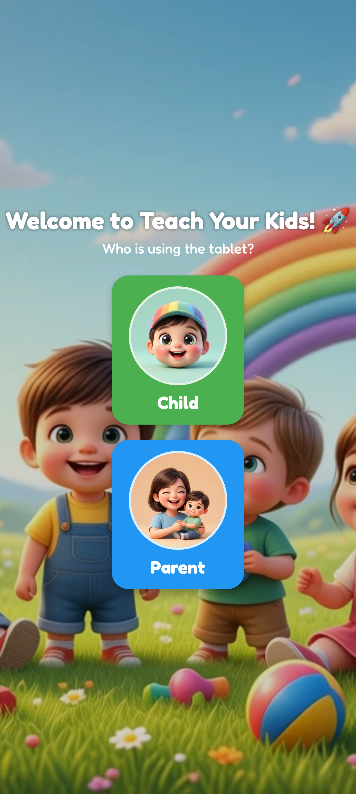
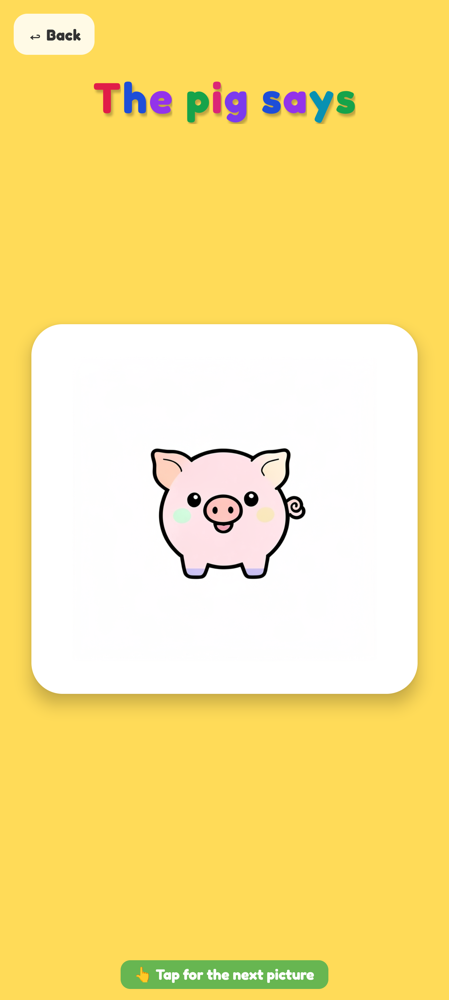
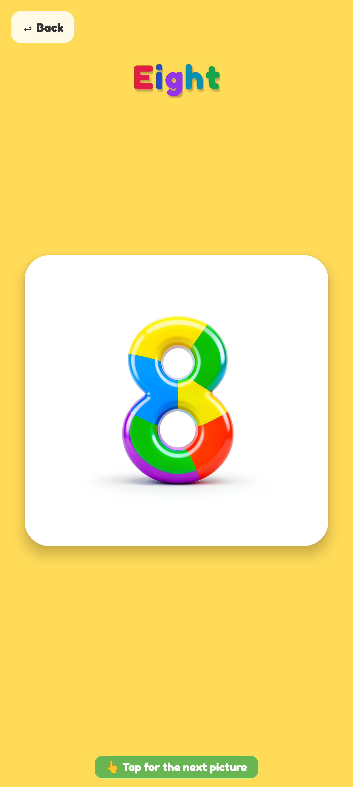
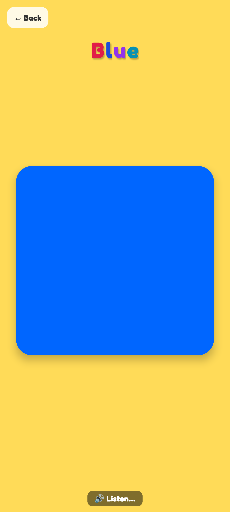
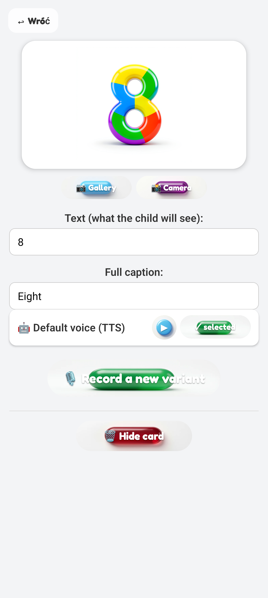

# 🍎 Teach Your Kids

Educational flashcard app for toddlers — **7 languages**, **AI-generated assets**, **parent-supervised content**.

> **Status: early beta — testing phase.** Currently being shared with a small group of testers for feedback. Several illustrations, some 3D buttons and a handful of animal sounds are still being iterated on. **Public release on Google Play and the Apple App Store is planned** once content quality is finalized.

[](https://github.com/JohnTDI-cpu/Teach-your-kids/releases/latest)

[](#)
[](#)
[](#)

---

## What it is

**Teach Your Kids** is a two-layer flashcard app for kids aged 2–4. The child sees full-screen flashcards (letters, numbers, colors, animals) with AI-illustrated images and clear voiceover. Behind a PIN-protected gate, the parent shapes exactly what their child sees — rename items, add their own flashcards, record their own voice for any item, and swap any image from camera or gallery.

<table>
  <tr>
    <td align="center" colspan="3"></td>
  </tr>
  <tr>
    <td align="center"></td>
    <td align="center"></td>
    <td align="center"></td>
  </tr>
  <tr>
    <td align="center"><sub>Animal flashcard</sub></td>
    <td align="center"><sub>Number flashcard</sub></td>
    <td align="center"><sub>Color (audio playing → tap is locked)</sub></td>
  </tr>
</table>

---

## Two layers

### 👶 Child mode — what your kid uses

- Big touch targets, Sesame Street-style falling letters, single tap to advance
- **Tap-during-playback is locked**: kids tap fast, but flashcards won't skip mid-audio — the card "wiggles" instead, and only advances after the audio finishes
- Per-language profile — switching language changes the UI, the flashcard set, and the voiceover all at once

### 👨‍👩‍👧 Parent mode — PIN-gated panel

The parent supervises and curates the child's content directly:

- **Edit any built-in flashcard**: change the image (gallery, camera or built-in), record your own voice for the lector, rename the label or caption
- **Add custom flashcards from scratch** in any category (your pet's name, grandma's photo, your kid's favorite toy)
- **Hide / restore** any item from rotation
- **Per-category label overrides** — "Animals" can become "Our Pets" if you like
- **Settings**: PIN, language

<p align="center">
  
  <br><sub>Parent panel — change image (gallery / camera), edit text + caption, record a custom voice, hide the card</sub>
</p>

---

## Languages & categories

**7 supported languages**: Polish, English, German, Spanish, French, Italian, Ukrainian. Each language ships its own letter alphabet (with native words for each letter), translated number/color/animal labels, and TTS voiceover.

| Category | What's inside |
|---|---|
| **Letters** | Per-language alphabet with kid-friendly words. PL: *„A jak Arbuz"*. EN: *„A is for Apple"*. UK: *„А — Авокадо"*. |
| **Numbers** | 0–9 with localized number words |
| **Colors** | Full-screen vibrant swatches with localized names |
| **Animals** | 11 farm animals with cartoon-style sound effects |

---

## How the assets are made

The repo ships with everything it needs — but every asset is regeneratable from `asset-gen/`.

| What | How |
|------|-----|
| **Flashcard images** | [Qwen-Image](https://github.com/QwenLM) GGUF + Lightning 8-step LoRA via ComfyUI |
| **Lector voiceover** | [Edge TTS](https://github.com/rany2/edge-tts) — neural voices per language (PL Zofia, EN Ana, DE Katja, ES Dalia, FR Eloise, IT Isabella, UK Polina) |
| **Animal SFX** | [ElevenLabs Sound Effects API](https://elevenlabs.io/sound-effects) — prompt-engineered cartoon sounds (e.g. *„cute cartoon duck quacking quack quack quack, children's animated TV show"*) |
| **Menu / 3D buttons** | Qwen-Image — same pipeline as flashcards, different prompts |

`asset-gen/content_data.py` is the single source of truth: letters, words, translations, image prompts, voice config — one file. Adding a new language ≈ adding one block + running the scripts.

---

## Project structure

```text
.
├── app/                       # React Native / Expo
│   ├── App.tsx                # Child mode + PIN gate + root navigation
│   ├── ParentApp.tsx          # Parent panel (recording editor, custom items, settings)
│   ├── AppContext.tsx         # i18n + per-language profile state
│   ├── state.ts               # Persisted state (AsyncStorage) + file I/O helpers
│   ├── AssetMap.ts            # Static asset registry generated from assets/
│   ├── Buttons.tsx            # 3D PillButton / RoundButton components
│   ├── i18n.ts                # UI string translations (7 languages)
│   └── assets/                # Pre-generated images + audio (committed)
│       ├── images/{letters,numbers,animals}/...
│       └── audio/{pl,en,de,es,fr,it,uk}/...
│
└── asset-gen/                 # Python regeneration pipeline
    ├── content_data.py        # Single source of truth
    ├── generate_images.py     # Qwen-Image flashcard graphics
    ├── generate_menu.py       # Menu / 3D button graphics
    ├── generate_audio.py      # Edge TTS voiceover for all 7 languages
    ├── fetch_animal_sounds.py # ElevenLabs SFX for animal sounds
    └── export_json.py         # Sync content data into the app
```

---

## Running the app

### Development

```bash
cd app
npm install
npx expo run:android        # build + install on connected Android device
# or
npx expo start              # for use with Expo Go
```

The first Android build takes 5–10 min (gradle compiles native dependencies — reanimated, gesture-handler, expo-av). Subsequent runs use Metro Fast Refresh.

### Regenerating assets (optional)

Requires Python 3.10+, ffmpeg, ComfyUI for image generation, and an ElevenLabs API key for animal SFX.

```bash
cd asset-gen
python generate_images.py --category animals
python generate_audio.py --kind animal
$env:ELEVENLABS_API_KEY = "sk_..."
python fetch_animal_sounds.py
```

---

## Roadmap

- Polishing letter and animal illustrations across all 7 languages — some still placeholder-quality
- More granular per-item voice options in the parent panel
- iOS testing (development is currently Android-first)
- Considering a small completion-tracking loop, without going gamified
- **Public release on Google Play Store and Apple App Store** after the current testing phase wraps up

---

## License

Educational use. AI-generated assets are subject to their respective model licenses (Qwen-Image, Edge TTS terms, ElevenLabs SFX).
